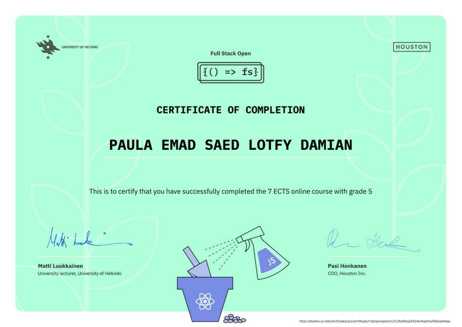

# Full Stack Open

This repository contains the exercises and projects completed as part of the **Full Stack Open** course. The course focuses on modern web development, covering topics such as React, Redux, Node.js, and MongoDB.

## Course Description

The **Full Stack Open** course is designed to teach the fundamentals of full-stack web development. It emphasizes building scalable and maintainable applications using modern tools and best practices. The course is suitable for both beginners and experienced developers looking to enhance their skills.

## Certificate of Completion

Upon successful completion of the first 7 parts of the course, participants receive a certificate. You can display your certificate below:

